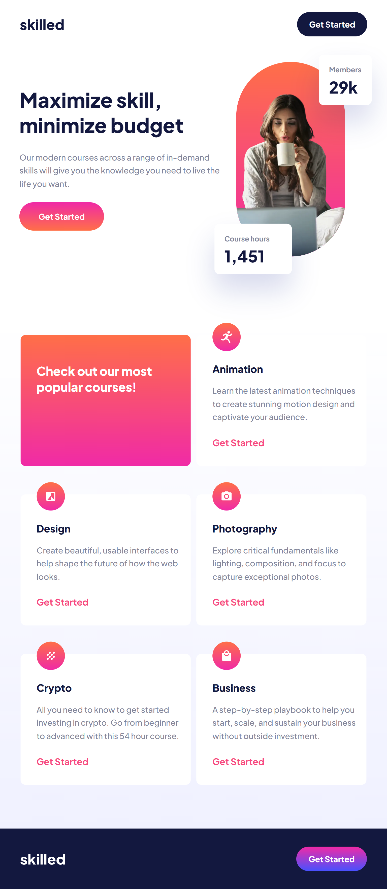

# Skilled elearning landing page

Hi everybody, this is my first big project.  

This project is made from *frontendmentor.io* website.  
It is created according to the template from Figma and fully responsive in pure HTML and CSS.

[See my result](https://janzask.github.io/skilled-elearning-landing-page/)

**Result:** 

**Original:**

